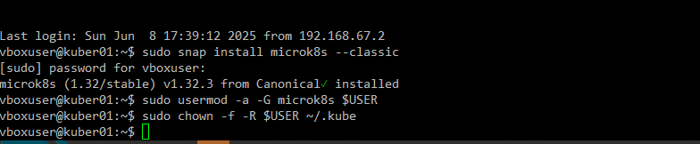
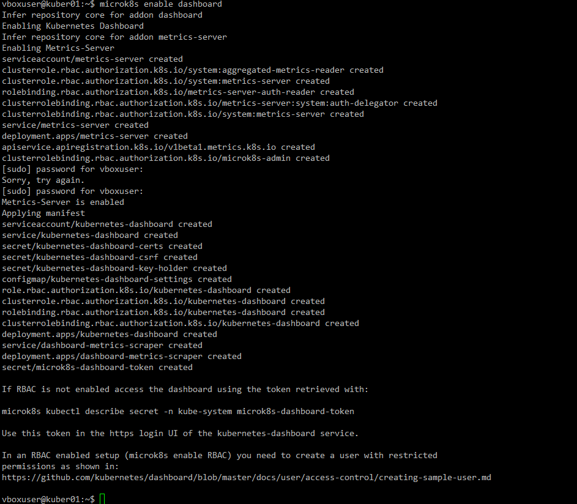
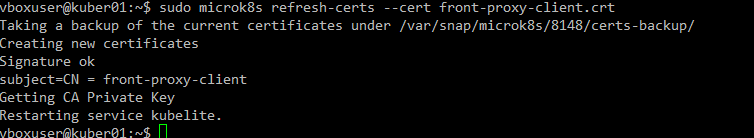
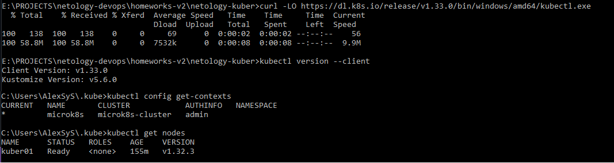
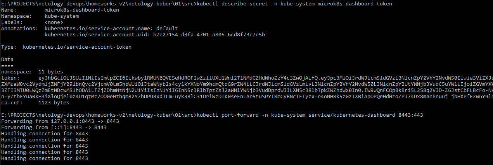
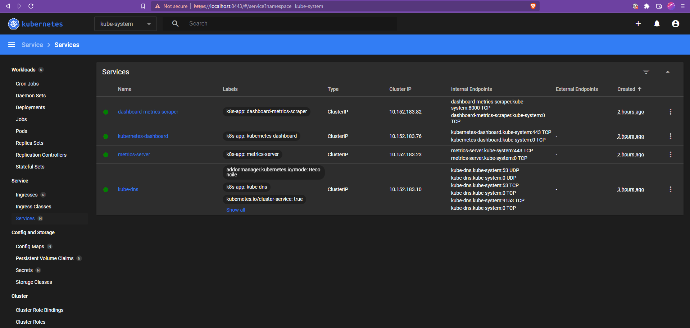

# 01. Kubernetes. Причины появления. Команда kubectl

### 1. Установка microk8s
Устанавливаем на ВМ Ubuntu 22.04

Включаем сервис dashboard:

Обновляем сертификат:

### 2. Установка kubectl
Устанавливаем kubectl на локальную машину, копируем `config` с ноды и проверяем:

 
Получаем токен для dashboard и делаем портфорвард:

Проверяем:

