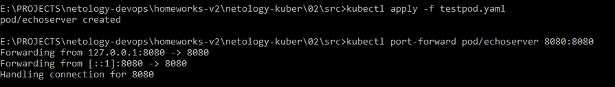
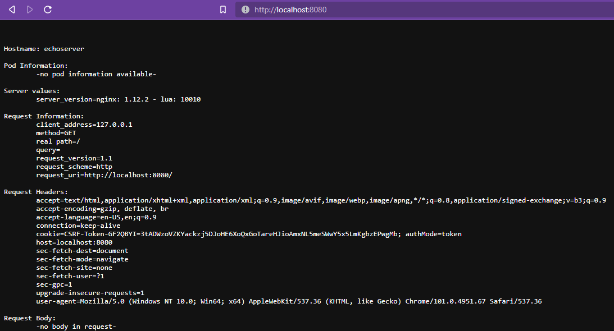
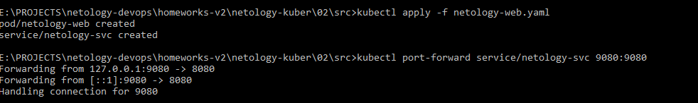
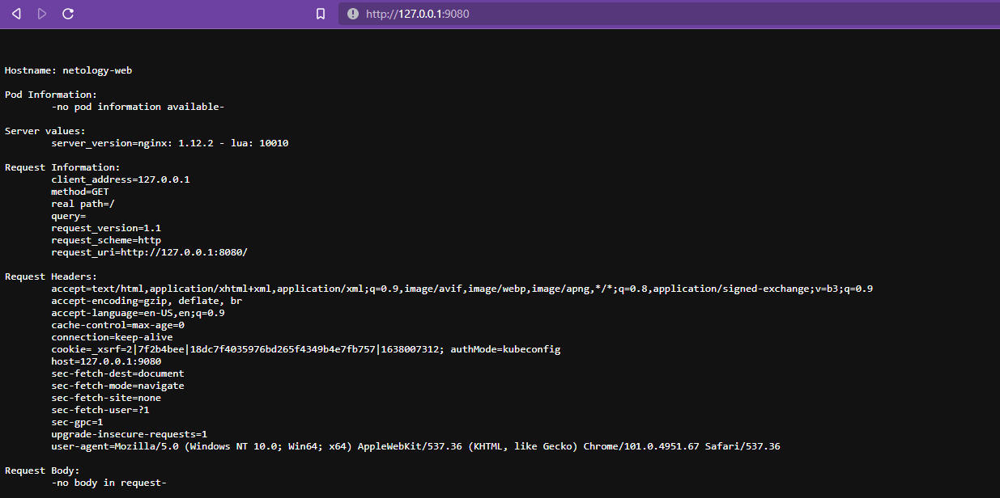

# 02. Базовые объекты K8S

### 1. 
Создаём конфигурацию pod:
```yaml
apiVersion: v1
kind: Pod
metadata:
  name: echoserver
spec:
  containers:
  - name: echoserver
    image: gcr.io/kubernetes-e2e-test-images/echoserver:2.2
    ports:
    - containerPort: 8080
```
Применяем и пробрасываем порт:



Результат:



### 2. 
Создаём pod и сервис:
```yaml
apiVersion: v1
kind: Pod
metadata:
  name: netology-web
  labels:
    app: netology-web
spec:
  containers:
  - name: netology-web
    image: gcr.io/kubernetes-e2e-test-images/echoserver:2.2
    ports:
      - containerPort: 8080
        name: webport


---
apiVersion: v1
kind: Service
metadata:
  name: netology-svc
spec:
  selector:
    app: netology-web
  ports:
  - protocol: TCP
    port: 9080
    targetPort: webport
```

Применяем и пробрасываем порт до сервиса:


 
Проверяем:




