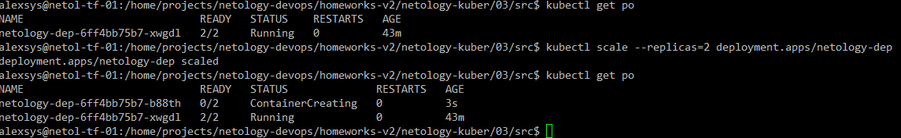

# 03. Запуск приложений в K8S

### 1. 
Создаём deployment:

```yaml
apiVersion: apps/v1
kind: Deployment
metadata:
  name: netology-dep
  labels:
    app: netology-app
spec:
  replicas: 1
  selector:
    matchLabels:
      app: netology-app
  template:
    metadata:
      labels:
        app: netology-app
    spec:
      containers:
        - name: nginx
          image: nginx:latest
        - name: mtool
          image: wbitt/network-multitool
```
Применяем. Не запускается контейнер с multitool:


Если посмотреть в лог, видим, что порт http уже занят:


Что логично, т.к. до этого на том же порту в том же поде запустился контейнер nginx.

Добавим контейнеру multitool переменные с настройками портов:
```yaml
env:
            - name: HTTP_PORT
              value: "1080"
            - name: HTTPS_PORT
              value: "10443"

```
Запустили:


Изменим количество реплик при помощи команды `kubectl scale --replicas=2` 



Создадим [сервис](src/service.yaml) для нашего приложения:


Создадим отдельный [pod](src/multitool.yaml) с multitool и проверим, что наши порты доступны с помощью curl:


### 2. 

Создаём [deployment](src/deployment2.yaml) с init-контейнером, который ожидает появления сервиса по DNS-имени:

```yaml
apiVersion: apps/v1
kind: Deployment
metadata:
  name: netology-dep2
  labels:
    app: app2
spec:
  replicas: 1
  selector:
    matchLabels:
      app: app2
  template:
    metadata:
      labels:
        app: app2
    spec:
      containers:
        - name: nginx
          image: nginx:latest
          ports:
            - containerPort: 80
              name: nginx-port
      initContainers:
        - name: busybox
          image: busybox:latest
          command: ['sh', '-c', "until nslookup netology-svc.default.svc.cluster.local; do echo waiting for netology-svc; sleep 1; done"]
```

и соответствующий [сервис](src/service2.yaml):

```yaml
apiVersion: v1
kind: Service
metadata:
  name: netology-svc
spec:
  selector:
    app: app2
  ports:
  - protocol: TCP
    port: 8080
    targetPort: nginx-port
    name: nginx-port

```

Проверяем: 
применяем сначала deployment, потом сервис, и убеждаемся что приложение  запустилось.


