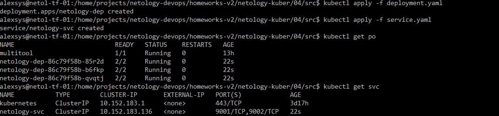
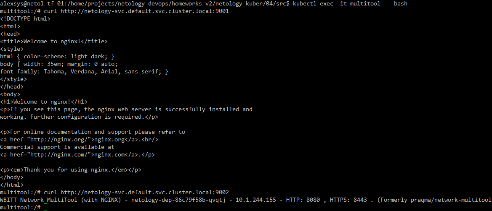
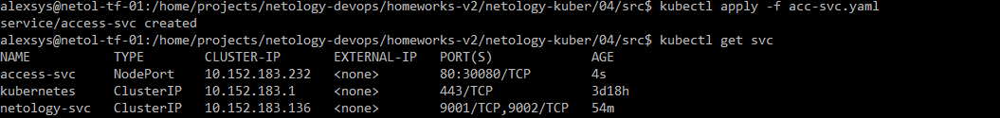
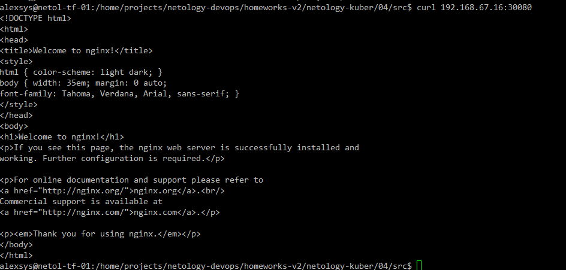

# 04. Сетевое взаимодействие в K8S. Часть 1

### 1. 

Модифицируем [deployment](src/deployment.yaml) и [service](src/service.yaml) из предыдущей работы под требования задания:

```yaml
apiVersion: apps/v1
kind: Deployment
metadata:
  name: netology-dep
  labels:
    app: netology-app
spec:
  replicas: 3
  selector:
    matchLabels:
      app: netology-app
  template:
    metadata:
      labels:
        app: netology-app
    spec:
      containers:
        - name: nginx
          image: nginx:latest
          ports:
            - containerPort: 80
              name: nginx-port
        - name: mtool
          image: wbitt/network-multitool
          env:
            - name: HTTP_PORT
              value: "8080"
            - name: HTTPS_PORT
              value: "8443"
          ports:
            - containerPort: 8080
              name: mtool-port

---
apiVersion: v1
kind: Service
metadata:
  name: netology-svc
spec:
  selector:
    app: netology-app
  ports:
  - protocol: TCP
    port: 9001
    targetPort: nginx-port
    name: nginx-port
  - protocol: TCP
    port: 9002
    targetPort: mtool-port
    name: mtool-port
```
Применим и проверим запуск:



Проверим, что приложения доступны внутри кластера:



### 2. 
Добавим [сервис](src/acc-svc.yaml), с типом NodePort для доступа к nginx извне:

```yaml
apiVersion: v1
kind: Service
metadata:
  name: access-svc
spec:
  selector:
    app: netology-app
  ports:
  - protocol: TCP
    port: 80
    nodePort: 30080
    name: web-port
  type: NodePort

```

Применим и проверим:




