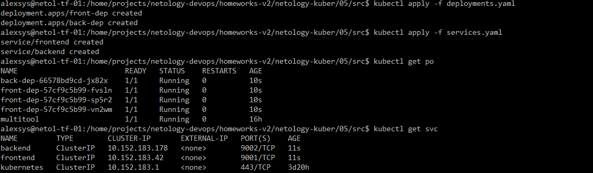
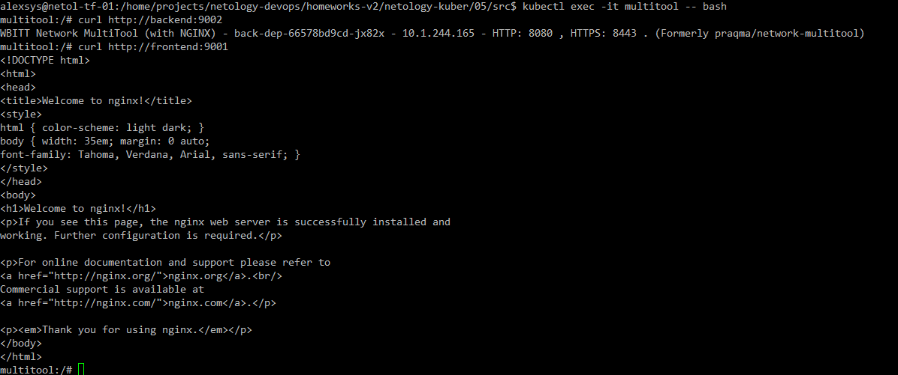
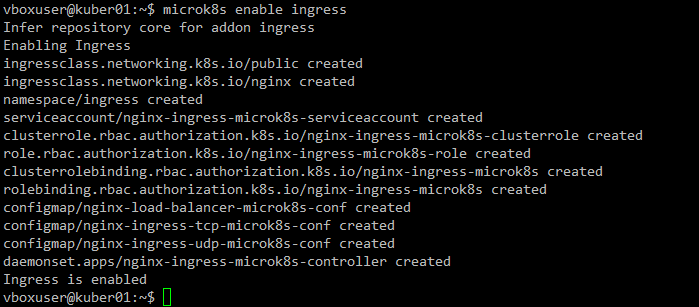
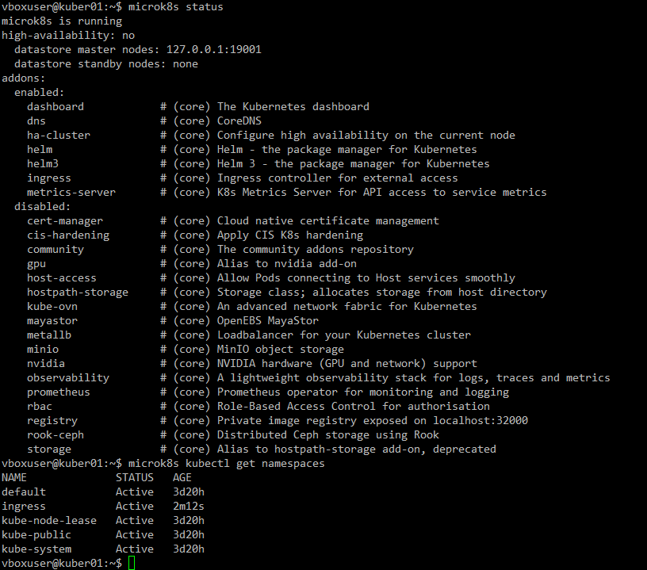
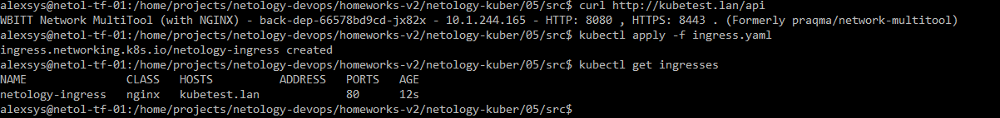
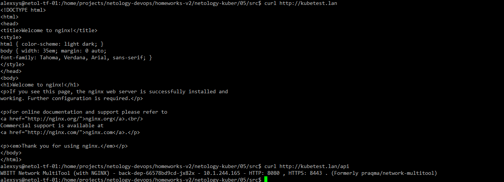

# 04. Сетевое взаимодействие в K8S. Часть 2

### 1. 

Создадим [deployments](src/deployments.yaml) и [services](src/services.yaml) для приложений back и front:

```yaml
apiVersion: apps/v1
kind: Deployment
metadata:
  name: front-dep
  labels:
    app: frontend
spec:
  replicas: 3
  selector:
    matchLabels:
      app: frontend
  template:
    metadata:
      labels:
        app: frontend
    spec:
      containers:
        - name: nginx
          image: nginx:latest
          ports:
            - containerPort: 80
              name: nginx-port

---
apiVersion: apps/v1
kind: Deployment
metadata:
  name: back-dep
  labels:
    app: backend
spec:
  replicas: 3
  selector:
    matchLabels:
      app: backend
  template:
    metadata:
      labels:
        app: backend
    spec:
      containers:
        - name: mtool
          image: wbitt/network-multitool
          env:
            - name: HTTP_PORT
              value: "8080"
            - name: HTTPS_PORT
              value: "8443"
          ports:
            - containerPort: 8080
              name: mtool-port

```
Службы:
```yaml
apiVersion: v1
kind: Service
metadata:
  name: front-svc
spec:
  selector:
    app: frontend
  ports:
  - protocol: TCP
    port: 9001
    targetPort: nginx-port
    name: nginx-port

---
apiVersion: v1
kind: Service
metadata:
  name: back-svc
spec:
  selector:
    app: backend
  ports:
  - protocol: TCP
      port: 9002
      targetPort: mtool-port
      name: mtool-port
```

Применим и проверим запуск:



Проверим, что приложения доступны внутри кластера:



### 2. 
Включим ingress-контроллер:





Добавим новый [ingress](src/ingress.yaml) для локального домена kubetest.lan:

```yaml
apiVersion: networking.k8s.io/v1
kind: Ingress
metadata:
  name: netology-ingress
  annotations:
    nginx.ingress.kubernetes.io/rewrite-target: /
spec:
  ingressClassName: nginx
  rules:
  - host: kubetest.lan
    http:
      paths:
      - path: /
        pathType: Prefix
        backend:
          service:
            name: frontend
            port:
              number: 9001
      - path: /api
        pathType: Prefix
        backend:
          service:
            name: backend
            port:
              number: 9002
```

Применим и проверим:




