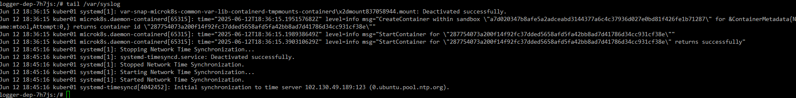

# 06. Хранение в K8s. Часть 1

### 1. 

Создадим [deployment](src/deployment.yaml) c двумя контейнерами - busybox и multitool, и подключим к ним общий том vol.
Контейнеру busybox зададим команду на запись текста в файл `/share/data.txt` раз в 5 сек:

```yaml
apiVersion: apps/v1
kind: Deployment
metadata:
  name: storage-dep
  labels:
    app: storage-app
spec:
  replicas: 1
  selector:
    matchLabels:
      app: storage-app
  template:
    metadata:
      labels:
        app: storage-app
    spec:
      containers:
        - name: bbox
          image: busybox:latest
          command: ['sh', '-c', 'n=1; while true; do echo "Sample data item $n" >> /share/data.txt; sleep 5; n=$(( n+1 )); done']
          volumeMounts:
            - name: vol
              mountPath: /share
        - name: mtool
          image: wbitt/network-multitool
          volumeMounts:
            - name: vol
              mountPath: /share
      volumes:
        - name: vol
          emptyDir: { }

```

Применим и проверим, подключившись к контейнеру multitool, что файл изменяется:


### 2.

Создадим DaemonSet с multitool и примонтируем к нему том в виде файла, указывающего на `/var/log/syslog` хостовой системы:

```yaml
apiVersion: apps/v1
kind: DaemonSet
metadata:
  name: logger-dep
  labels:
    app: logger-app
spec:
  selector:
    matchLabels:
      app: logger-app
  template:
    metadata:
      labels:
        app: logger-app
    spec:
      containers:
        - name: mtool
          image: wbitt/network-multitool
          volumeMounts:
            - name: syslog
              mountPath: /var/syslog
              readOnly: true
      volumes:
        - name: syslog
          hostPath:
            path: /var/log/syslog
            type: File
```

Запустим и подключимся к контейнеру:


Зайдем на хост машину и выполним `sudo systemctl restart systemd-timesyncd`. Проверим, что событие отразилось в журнале:

