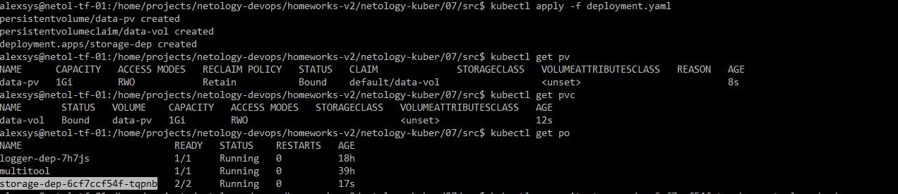
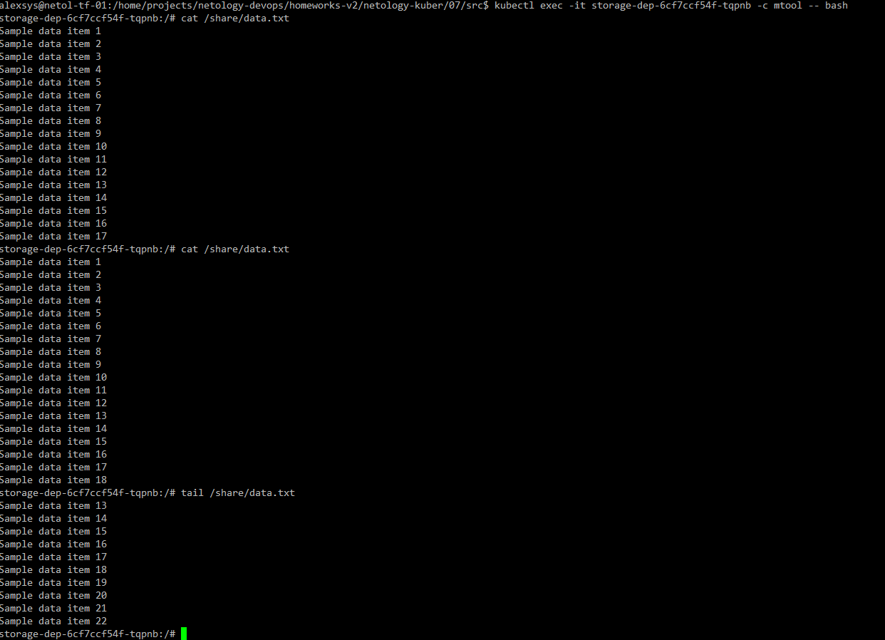
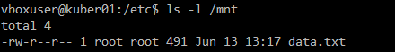
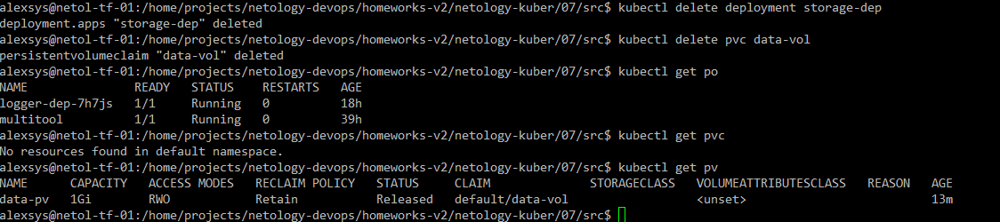
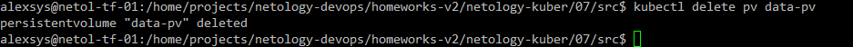
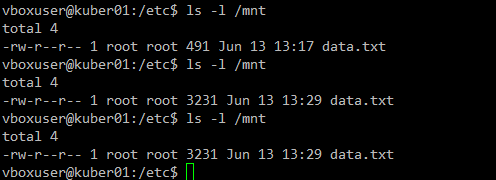
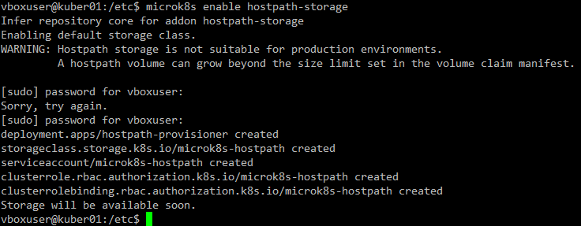
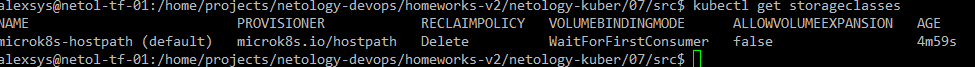
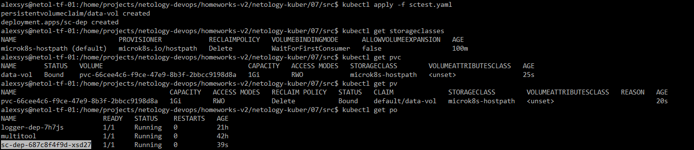
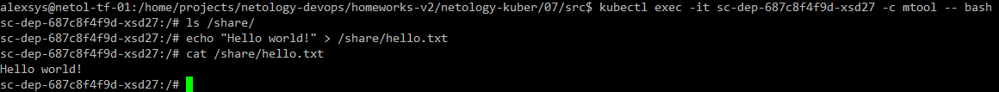

# 07. Хранение в K8s. Часть 2

### 1. 

Используем [deployment](src/deployment.yaml) из предыдущей работы, добавив к нему декларацию PersistentVolume 
и PersistentVolumeClaim:

```yaml
apiVersion: v1
kind: PersistentVolume
metadata:
  name: data-pv
spec:
  capacity:
    storage: 1Gi
  accessModes:
  - ReadWriteOnce
  hostPath:
    path: /mnt

---

apiVersion: v1
kind: PersistentVolumeClaim
metadata:
  name: data-vol
  namespace: default
spec:
  storageClassName: ""
  volumeMode: Filesystem
  accessModes:
    - ReadWriteOnce
  resources:
    requests:
      storage: 1Gi


```

Применим и проверим, подключившись к контейнеру multitool, что файл изменяется:





Сходимм на ноду, и убедимся, что файл есть там, где и должен быть:



Удалим deployment и pvc:



PV никуда не делся, файл с данными так же остался на месте, поскольку PersistentVolume - это глобальный объект в рамках кластера. 
Он не привязан ни к деплойментам/подам, ни к запросам на сторадж.

Удалим PV:



Файл остался на месте:



Чтобы при удалении PV удалились и данные, можно было при его создании указать `ReclaimPolicy` Delete или,
скорее, в нашем случае локальной ФС - `Recycle`.   

### 2.

Включили плагин storage в uk8s:





Создадим [deployment](src/sctest.yaml), использующий наше новое хранилище:

```yaml
apiVersion: v1
kind: PersistentVolume
metadata:
  name: data-pv
spec:
  capacity:
    storage: 1Gi
  accessModes:
  - ReadWriteOnce
  hostPath:
    path: /mnt

---

apiVersion: v1
kind: PersistentVolumeClaim
metadata:
  name: data-vol
  namespace: default
spec:
  storageClassName: ""
  volumeMode: Filesystem
  accessModes:
    - ReadWriteOnce
  resources:
    requests:
      storage: 1Gi

---

apiVersion: apps/v1
kind: Deployment
metadata:
  name: storage-dep
  labels:
    app: storage-app
spec:
  replicas: 1
  selector:
    matchLabels:
      app: storage-app
  template:
    metadata:
      labels:
        app: storage-app
    spec:
      containers:
        - name: bbox
          image: busybox:latest
          command: ['sh', '-c', 'n=1; while true; do echo "Sample data item $n" >> /share/data.txt; sleep 5; n=$(( n+1 )); done']
          volumeMounts:
            - name: vol
              mountPath: /share
        - name: mtool
          image: wbitt/network-multitool
          volumeMounts:
            - name: vol
              mountPath: /share
      volumes:
        - name: vol
          persistentVolumeClaim:
            claimName: data-vol


```

Запустим и подключимся к контейнеру, чтобы проверить возможность сохранения файлов:





