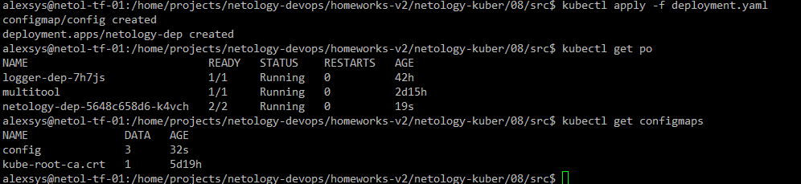
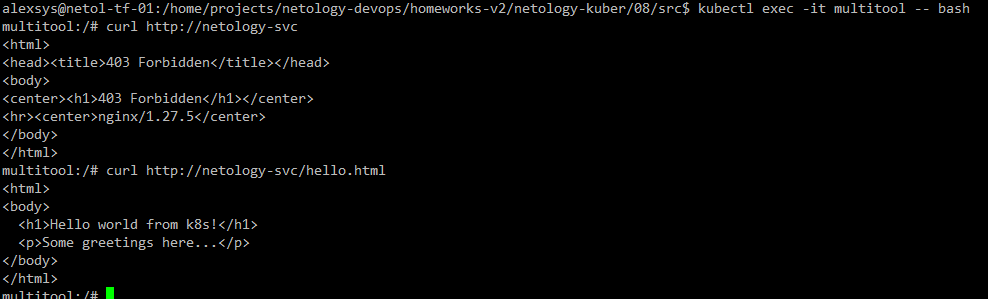
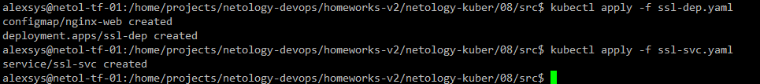
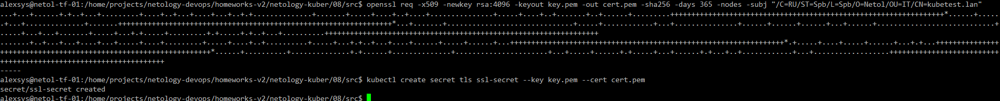
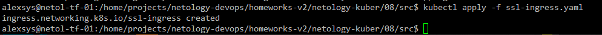
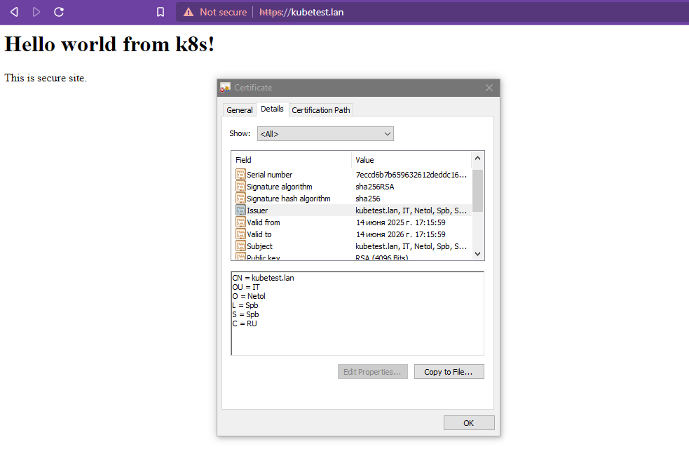

# 08. Конфигурация приложений

### 1. 

Создадим [deployment](src/deployment.yaml) из контейнеров nginx и multitool. Как и в работе №4, 
возникает проблема с конфликтом портов. Решим её на этот раз, добавив объект ConfigMap: 

```yaml
apiVersion: v1
kind: ConfigMap
metadata:
  name: config
  namespace: default
data:
  HTTP_PORT: "8080"
  HTTPS_PORT: "8443"
 ---
apiVersion: apps/v1
kind: Deployment
metadata:
  name: netology-dep
  labels:
    app: netology-app
spec:
  replicas: 1
  selector:
    matchLabels:
      app: netology-app
  template:
    metadata:
      labels:
        app: netology-app
    spec:
      containers:
        - name: nginx
          image: nginx:latest
          ports:
            - containerPort: 80
              name: nginx-port

        - name: mtool
          image: wbitt/network-multitool
          env:
            - name: HTTP_PORT
              valueFrom:
                configMapKeyRef:
                  name: config
                  key: HTTP_PORT
            - name: HTTPS_PORT
              valueFrom:
                configMapKeyRef:
                  name: config
                  key: HTTPS_PORT
          ports:
            - containerPort: 8080
              name: mtool-port


```

Применим:



Добавим к конфигурации файл `hello.html`, помещенный в confgMap, дополним конфигурацию томом и примонтируем его к контейнеру nginx.
Также добавим [сервис](src/service.yaml) для доступа. 

Проверим:




### 2.

Создадим [deployment](src/ssl-dep.yaml), с nginx и простым файлом `index.html`, помещённым в configmap:

```yaml
apiVersion: v1
kind: ConfigMap
metadata:
  name: nginx-web
  namespace: default
data:
   index.html: |
    <html>
    <body>
      <h1>Hello world from k8s!</h1>
      <p>This is secure site. </p>
    </body>
    </html>
---
apiVersion: apps/v1
kind: Deployment
metadata:
  name: ssl-dep
  labels:
    app: ssl-app
spec:
  replicas: 1
  selector:
    matchLabels:
      app: ssl-app
  template:
    metadata:
      labels:
        app: ssl-app
    spec:
      containers:
        - name: nginx
          image: nginx:latest
          ports:
            - containerPort: 80
              name: nginx-port
          volumeMounts:
            - name: web-vol
              mountPath: /usr/share/nginx/html
        - name: mtool

      volumes:
        - name: web-vol
          configMap:
            name: nginx-web
            items:
            - key: "index.html"
              path: "index.html"
```

И простой [сервис](src/ssl-svc.yaml) для доступа к приложению:

```yaml
apiVersion: v1
kind: Service
metadata:
  name: ssl-svc
spec:
  selector:
    app: ssl-app
  ports:
  - protocol: TCP
    port: 80
    targetPort: nginx-port
    name: nginx-port

```
Применяем:



Сгенерируем с помощью openssl самоподписанный сертификат и создадим секрет для него:



Создаём ingress для нашего приложения, использующий созданный секрет:

```yaml
apiVersion: networking.k8s.io/v1
kind: Ingress
metadata:
  name: ssl-ingress
  annotations:
    nginx.ingress.kubernetes.io/rewrite-target: /
spec:
  ingressClassName: nginx
  rules:
  - host: kubetest.lan
    http:
      paths:
      - path: /
        pathType: Prefix
        backend:
          service:
            name: ssl-svc
            port:
              number: 80
  tls:
    - hosts:
      - kubetest.lan
      secretName: ssl-secret
```

Применяем и проверяем:






