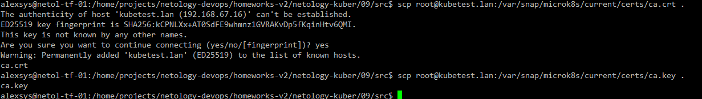
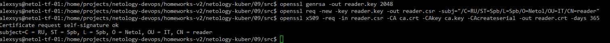
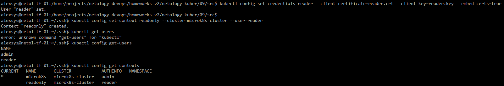
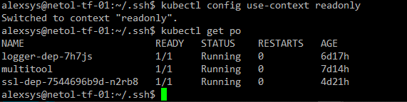
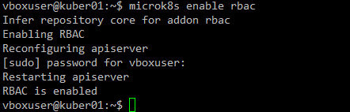
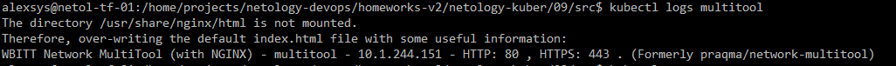
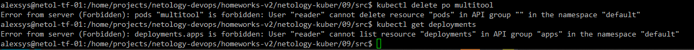

# 09. Управление доступом

### 1. 

Копируем с ноды корневой сертификат:



Создаём запрос и подписываем сертификат:



Настраиваем конфигурацию kubectl: Создаём нового пользователя, использующего сертификат, контекст, проверяем, что он имеет доступ.





Включаем RBAC в кластере:



Создадим [роль](src/role.yaml) и [RoleBinding](src/rolebinding.yaml) для нашего пользователя:

```yaml
apiVersion: rbac.authorization.k8s.io/v1
kind: Role
metadata:
  name: pod-readonly
rules:
  - apiGroups: [""]
    resources: ["pods","pods/log"]
    verbs: ["get", "list"]
---

kind: RoleBinding
apiVersion: rbac.authorization.k8s.io/v1
metadata:
  name: pods-read
  namespace: default
subjects:
- kind: User
  name: reader
  apiGroup: rbac.authorization.k8s.io
roleRef:
  kind: Role 
  name: pod-readonly
  apiGroup: rbac.authorization.k8s.io
```

Применяем и проверяем, что теперь права есть:


Просмотр логов:



Проверим, что другие действия и объекты недоступны:




