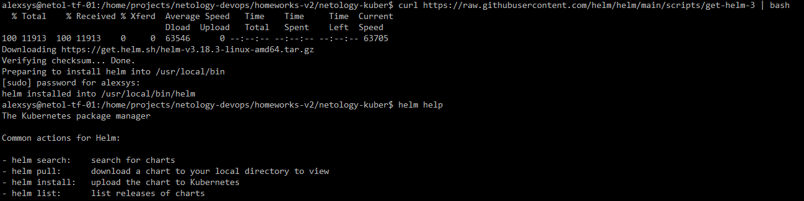
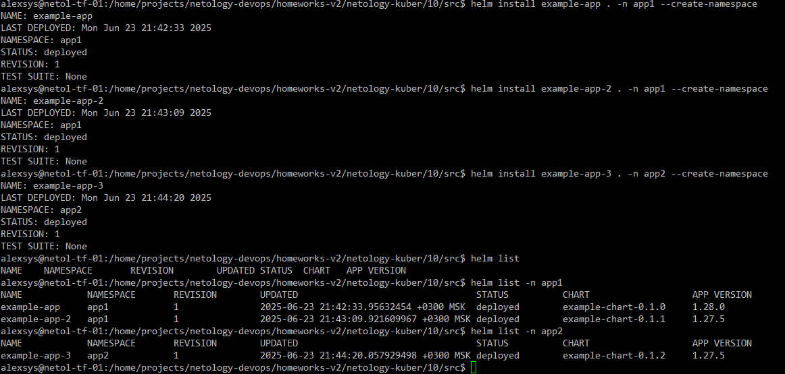
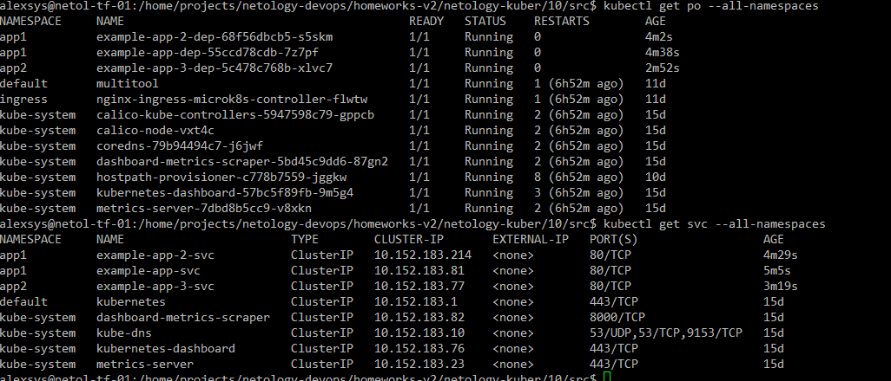
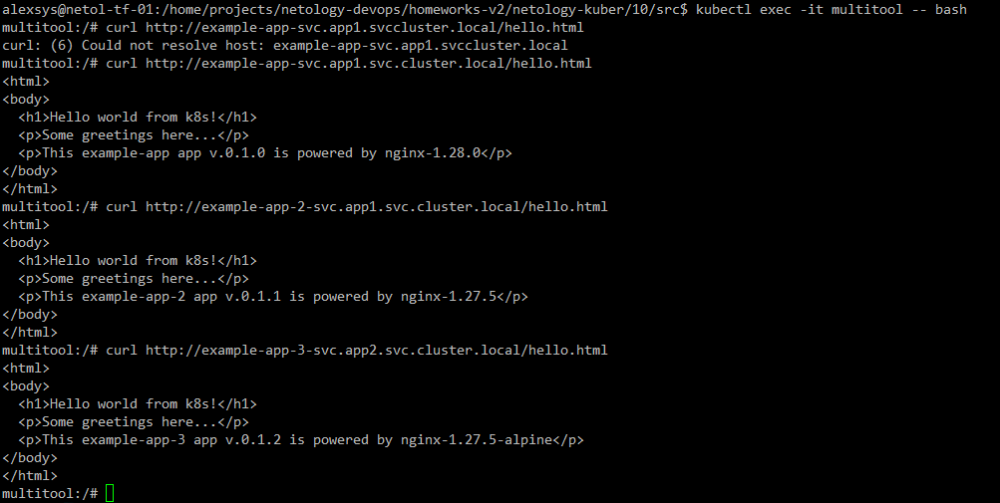

# 10. Helm

### 0. Устанавливаем Helm




### 1.

Создадим [chart](src/Chart.yaml) для тестового приложения на основе nginx, состоящего из 
[deployment](src/templates/deployment.yaml), [service](src/templates/service.yaml) и [configmap](src/templates/configmap.yaml) с
тестовым html-файлом. Для удобства выведем в содержимое файла версии чарта и приложения:

```yaml
apiVersion: v1
kind: ConfigMap
metadata:
  name: {{ .Release.Name }}-config
  namespace: {{ .Release.Namespace }}
data:
   hello.html: |
    <html>
    <body>
      <h1>Hello world from k8s!</h1>
      <p>Some greetings here...</p>
      <p>This {{ .Release.Name }} app v.{{.Chart.Version}} is powered by {{.Values.app.image.name}}-{{.Values.app.image.tag}}</p>
    </body>
    </html>
```

Имя и тег образа приложения вынесем в переменные в файле [values](src/values.yaml) 

Установим три версии приложения, изменяя версии чарта и  образа в каждом из них:





Проверим работу с помощью отдельного пода с multitool:



